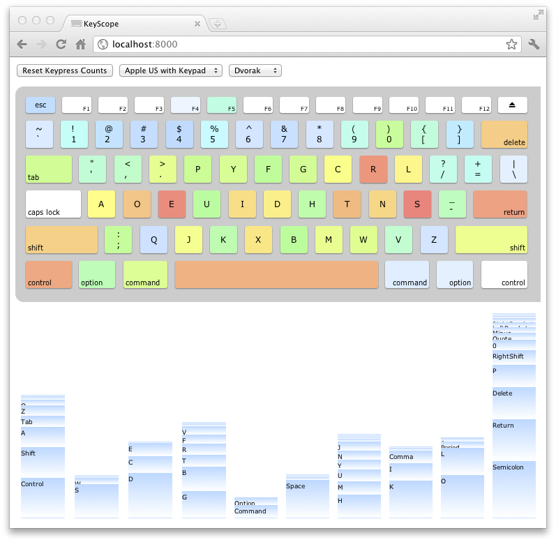

# KeyScope

## Quick Start

0.  KeyScope only runs on Mac OS X (for now). I've tested it on Lion and Snow Leopard. If you know how to write a keyboard sniffer for some other OS, feel free to send me a pull request.

1.  Run `keyscope.py`.  You'll get some warnings if you're on Snow Leopard.  Ignore them.

2.  If you get a popup window telling you that System Events is trying to unlock Universal Access preferences, enter your password. This turns on the "Enable access for assistive devices" option in the Universal Access pane of your System Preferences. It must be enabled for KeyScope to sniff your keyboard. You won't get this popup window if that option is already enabled.

3.  When `keyscope.py` is ready, it'll print the URL it is listening on. It's normally [`http://localhost:8000/`](http://localhost:8000/). Go to that URL in Chrome or Safari or Firefox.

4.  Do normal activities. KeyScope track your key presses even when you're using other windows and other applications (as long as you leave KeyScope loaded in your browser). You can type in the KeyScope browser window to see what happens, but it's really designed to monitor key and finger use during your normal computer usage. In some browsers, pressing `esc` in the KeyScope browser window will kill its live connection to the sniffer. Just reload if that happens.

## What's in the KeyScope window

After you've typed for a while, the KeyScope window looks like this:

The top part of the window shows a keyboard. KeyScope tracks how often you press each key; the reddest keys are the ones you press the most often. The bluest are the ones you pressed the least often. The white keys are keys you haven't pressed (while KeyScope was recording). You can mouse over each key to see the exact number of times KeyScope has recorded a press event for that key. The keyboard view scrolls left/right if the keyboard doesn't fit in the window. On Mac OS X Lion, the horizontal scroll bar gets hidden automatically it WebKit-based browser. Grumble.

The bottom part of the window displays a chart of how many times each key was pressed, grouped by which finger (normally) presses that key. KeyScope has built-in key-to-finger assignments. The numeric keypad and some other special keys don't get assigned to fingers. If you're interested in how much work you're doing with each finger, like I am, this chart is more interesting than the keyboard view.

## Motivation

I saw [a post on Hacker News](http://news.ycombinator.com/item?id=2973776) linking to ["Most Pressed Keys and Programming Syntaxes"](http://www.mahdiyusuf.com/post/9947002105/). I thought it was an interesting idea, but I had a couple of problems with it. One problem is that it really draws a heatmap of what printable characters you paste into a text box, not what keys you press when coding in various languages. So it ignores whitespace, modifiers keys like Control and Shift, and other keys like Escape and Delete. Those are very interesting keys!  Another problem is that it doesn't group the keys by finger, which is a more interesting way to look at the data. So I decided to try my hand at it.

## Further development

0.  Let you change the assignment of keys to fingers in the GUI by dragging key bars in the finger chart.

1.  Build per-application profiles. The Mac OS X key sniffer uses a Quartz event tap, and the tap can be configured to annotate each sniffed event with the process ID that will receive the event. [It's easy to map the process ID to an application name](http://developer.apple.com/library/mac/#documentation/AppKit/Reference/NSRunningApplication_Class/Reference/Reference.html), and the sniffer could trivially pass that name along to the KeyScope front end. More detailed breakdown (for example what file you're editing in emacs when you press a key) would be more difficult to obtain and require per-application code.

2.  Track which keys you press right before pressing delete, and which keys you press right after. This would allow you to analyze your typing errors.

## Building the sniffer on Mac OS X

The sniffer is a small Objective-C command-line program. The source code is under `sniffer-macosx` in the form of an Xcode project. It probably requires at least Xcode 4.0 to build, and maybe 4.1 (which is what I used). I include an executable in the distribution, but if you want to build it yourself, it's easy enough. You can use Xcode, or you can run the `build.sh` script in the `sniffer-macosx` directory:

    cd sniffer-macosx
    ./build.sh

That will compile the `sniffer` program and copy it to the `keyscope` directory (or whatever directory is the parent of the `sniffer-macosx` directory). It uses the `xcodebuild` program.

